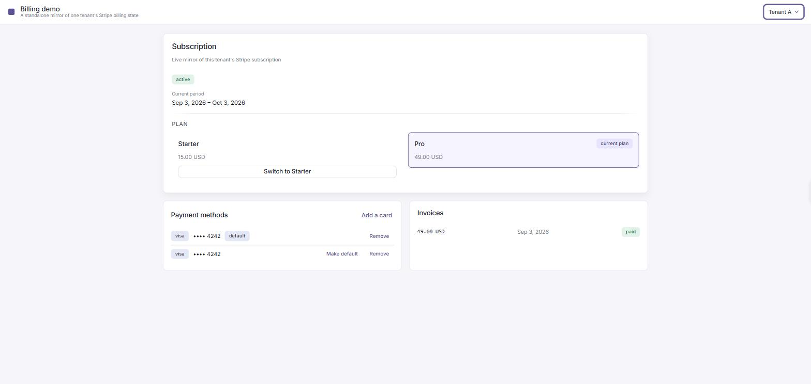
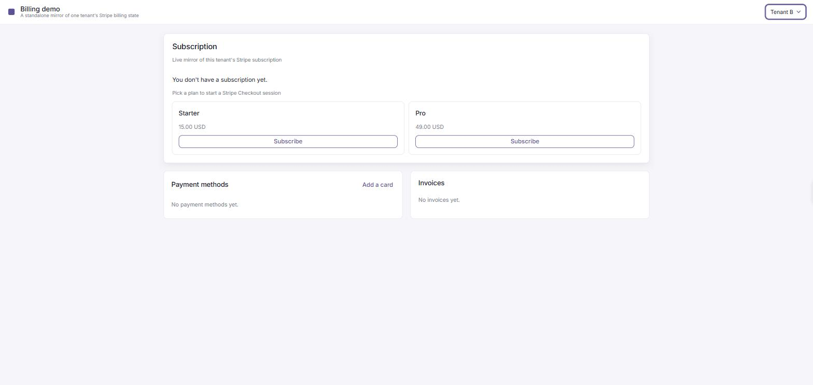

# stripe-billing

A standalone billing / subscriptions module: a Rust workspace (Axum) plus a
React/TypeScript demo host.

**It is a pluggable component.** The module owns billing and nothing else — no
authentication, no user management, no routing, no UI shell. Anything a host
product would already have, the module consumes rather than provides.

---

## 1. What this is

The module mirrors Stripe. Stripe is the authority on what a subscription
costs and whether an invoice was paid; the Postgres tables here are a local
cache of what Stripe last said, kept current by webhooks. Every write goes to
Stripe first and is mirrored afterwards, never the reverse.

What a host supplies, and the module never implements:

- **Authentication and identity.** The module receives a `TenantId` from the
  host through a trait it does not implement. The `demo` binary mints tokens
  so the API can be driven without a real login flow; it is scaffolding and is
  labelled as such everywhere it appears.
- **User management, permissions, routing, and the surrounding UI.**

Out of scope / TODO later:

- **Tax, dunning and revenue recognition.**
- **Stripe's hosted customer portal** — it would handle plan changes and
  payment methods for us, which is the work this module exists to show.
- **Metered / usage-based billing.**

---

## 2. Architecture

```
crates/
  domain/          models, value objects, ports (traits), error taxonomy
  service/         use cases orchestrating ports — no I/O of its own
  persistence/     sqlx adapters implementing the domain ports
  stripe-adapter/  Stripe client, idempotency ledger, webhook verification
  api/             Axum router factory, wire DTOs, error → HTTP mapping
  demo/            binary: composition root, config, demo-only auth
frontend/          React + TypeScript + Vite (the demo host)
migrations/        thirteen numbered, idempotent SQL migrations
```

| crate | depends on | kind |
|---|---|---|
| `domain` | *nothing* | pure library |
| `service` | `domain` | pure library |
| `persistence` | `domain` | adapter |
| `stripe-adapter` | `domain` | adapter |
| `api` | `domain`, `service` | library — a `Router` factory |
| `demo` | all five | **the only binary** |

**Dependency direction is strictly inward.** `domain` declares the ports —
`SubscriptionRepository`, `BillingProvider`, `WebhookVerifier`,
`BillingEventSink`. `persistence` and `stripe-adapter` implement them.
`service` orchestrates them without knowing which adapter is behind them.

Two absences carry the design:

- **`api` depends on neither `persistence` nor `stripe-adapter`** — it holds
  `Arc<dyn Reads>`, `Arc<dyn Writes>` and friends, supplied by a host.
- **`service` does not either**, which is why its use cases — including the
  whole webhook processor — test with Docker off against in-memory doubles.

One edge breaks the picture, worth naming before it is found: `stripe-adapter`
lists `persistence` as a **dev-dependency**, because the ledger tests run the
real adapter against a real Postgres. It never appears in a production build.

## 3. Running it

Four terminals. Postgres and Docker running; the Stripe CLI logged in to the
same test-mode account as `STRIPE_SECRET_KEY`.

```bash
cargo run -p demo -- seed                                          # once
cargo run -p demo
stripe listen --forward-to localhost:8080/api/v1/webhooks/stripe   # note /api/v1
cd frontend && npm install && npm run dev                          # :5173
```

Everything is served under `/api/v1`, webhook included. The Vite dev server
proxies `/api` to `:8080`, so the browser talks to one origin and there is no
CORS layer anywhere in the workspace — CORS is host policy, and keeping it out
of the module is the point.

### Configuration

Seven variables, all required, validated at startup; a missing one exits
non-zero naming it. Copy `.env.example` to `.env` (gitignored).

| Variable | Purpose | Secret |
|---|---|---|
| `DATABASE_URL` | Postgres connection for the mirror and ledger tables | yes |
| `STRIPE_SECRET_KEY` | the `sk_…` key the write path uses | **yes** |
| `STRIPE_WEBHOOK_SIGNING_SECRET` | the `whsec_…` printed by `stripe listen` | **yes** |
| `BILLING_JWT_SECRET` | HS256 secret for `demo`'s token mint; `api` has no use for it | **yes** |
| `CHECKOUT_SUCCESS_URL` | `http://localhost:5173/checkout/return` — host config, never a request field | no |
| `CHECKOUT_CANCEL_URL` | `http://localhost:5173/` | no |
| `PORT` | TCP port the server binds | no |

`RUST_LOG` is optional. Secrets become `SecretString` at the moment of
reading, so a stray `#[derive(Debug)]` cannot put a Stripe key in a log line,
and none is ever placed in a URL. The Stripe **API version is pinned at
compile time** from the SDK, not configured — a bump is a `Cargo.toml` change
rather than a second place that can drift.

One variable reaches the browser: `VITE_STRIPE_PUBLISHABLE_KEY`. Vite inlines
*every* `VITE_`-prefixed variable into the bundle, so the rule is not "don't
log secrets", it is **no secret may take that prefix**:

```bash
cd frontend && npm run build
grep -c "sk_test\|sk_live\|whsec_" dist/assets/*.js     # 0
```

### Seeding

`cargo run -p demo -- seed` creates two fixed-id tenants, each with a Stripe
customer, two plans and one subscription. It needs four more variables, read
only by the seed: `SEED_PLAN_{A,B}_STRIPE_PRICE_ID` and
`SEED_PLAN_{A,B}_STRIPE_PRODUCT_ID`. Point them at any two prices in your own
test-mode account — the seed mirrors them rather than creating them, so a
wrong id is a display-only mistake. The ids are fixed rather than random,
which is what makes re-running the seed a no-op.

**Both subscriptions seed `incomplete`, not `active` — this is expected.** A
subscription for a customer with no payment method has an open invoice and
nothing to pay it with.

### The demo path

At `http://localhost:5173`:

1. Subscription shows **incomplete**; invoices and cards are empty. All three
   are correct renderings of real seeded data.
2. **Cancel** it → "no subscription".
3. **Subscribe** → Stripe's hosted Checkout. Pay with `4242 4242 4242 4242`.
4. Return to `/checkout/return` → **pending** until the webhook lands, then
   `active`. Not before.
5. The paid invoice and the attached card appear.
6. Add a second card through the Payment Element — pending, then it appears.
   Set default, detach.
7. Switch tenants in the header; the other tenant's data replaces it.

**Why cancel comes first**, since it looks arbitrary: attaching a card does
not settle the existing subscription's open invoice — that invoice has its own
PaymentIntent, and no route here pays it. Running Checkout alongside an
incomplete subscription would create a *second* subscription at Stripe.
Cancelling first uses only routes that exist and yields, in one hosted flow,
an active subscription, a card, a paid invoice and the webhooks that mirror
them.

If a step hangs, both pending states poll for twenty seconds and then ask
whether `stripe listen` is running — the most likely cause.

### What it looks like

The demo host is one page: the tenant switcher in the nav, the subscription
panel, then payment methods and invoices side by side. Both screenshots below
are the same build against the same database — only the selected tenant
differs.

**Tenant A**, after running the demo path above: an `active` subscription on
Pro, the card that paid for it plus a second one, and the invoice Stripe
raised. Every value on the page came from the local mirror, not from a live
Stripe call.



**Tenant B**, one select away: no subscription, no cards, no invoices. Nothing
about the request changed except the tenant in the token — the module reads
the tenant from a host-supplied extractor and every repository method is scoped
by it, so this is the isolation the tests assert, shown rather than claimed.



Amounts render from `{amount_minor, currency}` — `49.00 USD` is `4900` and
`"USD"` on the wire, formatted in the browser, because formatting is a
presentation concern and a pre-formatted string would bake a locale into the
API.

### Commands

```bash
cargo test --workspace          # cargo fmt --all / clippy --workspace --all-targets
cargo test -p domain money::    # one test or module by name
cargo doc --workspace --no-deps --open
```

```bash
cd frontend
npm run typecheck   # tsc --noEmit — the lint gate
npm run test        # vitest
npm run build
```

Integration tests bring up a disposable Postgres via `testcontainers` and need
Docker. The 124 unit tests across the library crates do not — `service`'s 70,
covering every use case and the webhook processor, run against doubles.

---

## 4. The API surface

`billing_router` mounts eleven tenant-scoped routes; `webhook_router` serves
`POST /webhooks/stripe` alone. `billing_router` is generic over a host-supplied
tenant extractor — **the tenant never crosses the wire as input**, and ids in
a path are always *local* uuids, resolved to Stripe ids server-side.

**Read** — the local mirror only, no outbound Stripe call:

| Method | Path | Returns |
|---|---|---|
| GET | `/plans` | the tenant's plans |
| GET | `/subscription` | the current subscription, or `null` (200, not 404) |
| GET | `/invoices` | keyset page (`?limit=` 1–100, `?after=` opaque cursor) |
| GET | `/invoices/{id}` | one invoice; unknown id and another tenant's both 404 |
| GET | `/payment-methods` | stored cards (brand / last4 / default only) |

**Write** — each goes through the idempotency ledger; ownership is checked
*before* the outbound call, so a cross-tenant id is a 404 with no call made:

| Method | Path | Does |
|---|---|---|
| POST | `/subscriptions/checkout-session` | Checkout Session; returns the hosted `url` |
| POST | `/subscriptions/{id}/change-plan` | change plan, prorated |
| POST | `/subscriptions/{id}/cancel` | at period end (default) or immediately |
| POST | `/payment-methods/setup-intent` | SetupIntent → `client_secret` |
| POST | `/payment-methods/{id}/default` | set default: Stripe first, then the mirror |
| DELETE | `/payment-methods/{id}` | detach at Stripe, soft-delete the mirror; 204 |

**Webhook**, no tenant context, authenticated by signature:
`POST /webhooks/stripe`.

**Demo scaffolding**, `demo` only: `POST /demo/token` mints a token for any
`tenant_id` given to it — **not authentication**, no identity check of any
kind. It exists so the routes above can be driven without a host. `demo` logs
a warning naming it at every startup.

Errors are `application/problem+json` (RFC 9457) with a deliberately coarse
`detail` that never carries the raw cause, and a `correlation_id` generated
server-side and logged alongside — never accepted from an inbound header.

---

## 5. Design decisions

Each is argued at length in the rustdoc on the type that implements it; these
are the decision and the alternative rejected.

**Multi-tenancy — and why not RLS.** `TenantId` is enforced at four
independent layers: the type (a newtype, not a bare `Uuid`), the port
signature (every repository method takes it, so there is no method that could
read across tenants), the SQL (`WHERE tenant_id = $1`), and the tests
(cross-tenant access asserts 404 — the same response as an unknown id, so the
API cannot be used to probe for another tenant's records). The tenant reaches
a handler only from the host's extractor; accepting `tenant_id` as a request
parameter would be textbook IDOR, and the `T: TenantExtractor` bound makes
that a compile-time property. **RLS was considered and deferred:** the module
uses one shared `PgPool`, so RLS would mean `SET LOCAL` on every transaction
and certainty that no query escapes one — trading a greppable predicate for an
implicit session property whose failure mode is a silent full-table read. RLS
becomes right as soon as connections are per-tenant.

**Soft delete.** Rows carry `deleted_at` and are never physically removed —
which is more than a column: unique indexes are partial
(`WHERE deleted_at IS NULL`) so a deleted row does not block a new one with
the same natural key, and `ON DELETE RESTRICT` makes a physical delete fail
loudly rather than cascade quietly.

**Money is integer minor units plus a currency**, everywhere — the domain, the
DTOs and the frontend. Both `Money` fields are private, so an amount cannot
exist without its currency, and `add` is fallible on a currency mismatch.
There is no `f64` in the money path. The wire shape is
`{"amount_minor": 1999, "currency": "EUR"}` — not a float, and not a
preformatted string, which would push locale and rounding into whatever
produced it. The frontend formats with `Math.trunc`/`%`, never `amount / 100`.
**Limitation:** the divisor is 100 — correct for USD, EUR and GBP, wrong for
zero-decimal currencies like JPY.

**Idempotency: the key is persisted before the call, completed after.** A
fingerprint of the request inputs (length-prefixed, so two field splittings
cannot collide) reserves a ledger key for `(tenant, operation, fingerprint)`;
a matching row inside a 23-hour window returns the same key and Stripe
deduplicates the call. **Why `Uuid::new_v4()` at call time is not
idempotency:** a key generated per attempt is a *new* key on the retry, so
Stripe sees an unrelated request and creates a second subscription. Surviving
the failure that caused the retry means being in the database before the call.
The window sits just under Stripe's own 24-hour retention.

**Webhooks invert every assumption the outbound path makes.** The body is raw
`Bytes`, never `Json<T>` — the signature is an HMAC over the exact bytes sent,
and an extractor that deserialised and re-encoded it would break verification
irrecoverably. Verification happens before anything parses. A header can carry
several `v1` signatures during a rotation, so the check accepts if **any**
matches; the timestamp tolerance is five minutes and symmetric, because a
timestamp too far in the future is as suspicious as one too far in the past.
**Dedup is the insert, not a check before it** — every event id hits a unique
constraint and the conflict *is* the signal, leaving no window a redelivery
could slip through. **Ordering is resolved by Postgres:** mirror rows carry the
event's `created_at` and every update is guarded by
`last_event_created_at <= EXCLUDED.last_event_created_at`, so a late event
simply does not apply. The tenant is resolved from the mirror by Stripe
customer id, never read from the payload. Nine event types are handled;
everything else is acknowledged and ignored. **Almost everything returns
200** — Stripe retries non-2xx for days, so a 500 on "we don't handle this"
would queue a permanent retry against a handler that can never succeed.

**What a host must supply.** `TenantExtractor` (required): an Axum
`FromRequestParts` extractor rejecting with the module's own `ApiError`, which
is what keeps every error in `problem+json`; omitting it is a compile error,
not a runtime 500. `BillingEventSink` (optional): how the module tells a host
something changed. Dedup and the mirror write happen *before* the sink is
called, and a sink failure does not roll back the mirror — the mirror is a
fact about what Stripe said, the sink is a side effect of it. The host
implements it with no Stripe client in its own manifest. **One precondition:**
the webhook route must receive the body unmodified, so a compression or
body-rewriting layer mounted *above* this router breaks verification — and it
looks like a signing-secret mismatch, not like middleware.

**Two router factories, deliberately.** `webhook_router` is not generic: that
route authenticates by signature and has no tenant. On the generic router, a
tenant extractor would become a precondition of it — a regression that
surfaces as Stripe receiving 401s.

**The frontend is a host that installs a feature.** `host/` owns the API
client, the token and the tenant; `billing/` owns endpoints, hooks and
components. `host/` imports nothing from `billing/` (`grep -rn "billing/"
frontend/src/host/` prints nothing), and of the four things `billing/` imports
back, none is the token — there is one authenticated `fetch` in the app.
Every query key carries the tenant id, built through one factory, and the
cache is cleared on switch. State this precisely: **cache partitioning, not
authorization.** The server was never at risk; a key collision would have been
a display bug. **The redirect is a UX signal; the webhook is the truth** —
neither Checkout's return nor the Element's confirmation renders success on
its own; both poll until the mirror reflects it. The token lives in React
state only.